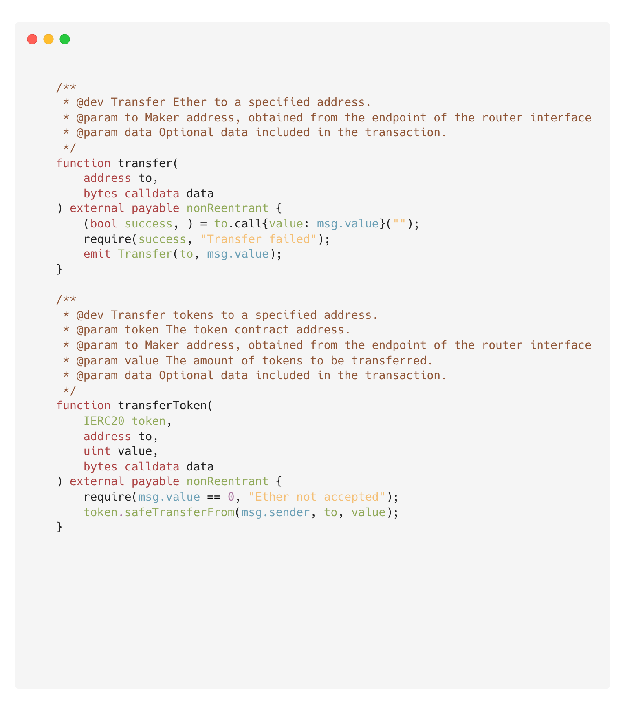

# Router Contract

## Contract

used to initiate cross-chain transactions with us within your contract.

:::tip

Check the [API Docs](/docs/BridgeOnVizing/api) to find the **contract address** for each networks.

:::



## Methods

- `transferToken` *The ERC20 token of the chain where the contract is located cross-chain*

:::note Parameters

- token=> ERC20 contract address (if not approved, you need to approve it first)
- to=>address (pass Orbiter Maker address)
- value=>uint (quantity)
- data=> bytes (extended parameters that need to be passed) [↓see below↓](#blank)

:::

- `transfer` *Cross-chain native main currency of the chain where the contract is located*

:::note Parameters

- to => address (pass Orbiter Maker address)
- data=> bytes (extended parameters that need to be passed) [↓see below↓](#)

:::

## Introduction to Data extended parameters

### parameters

| key | value | required |
| --- | ----- | -------- |
| c   | Security code, vc parameter obtained through routers interface, if the amount has a mantissa, it does not need to be passed here. | false |
| t   | Target link receiving address (can be passed when ToStarknet and cross-address) | false |
| app | Your dapp name(short name), for statistics | false |

### format rule

url encode: param1=value1&param2=value2

example:

```url
c=9002&t=0xEFc6089224068b20197156A91D50132b2A47b908&app=YourAppName
```

hexadecimal encoding: [Utils](/docs/BridgeOnVizing/utils)

## ABI

```json
[
    {
        "anonymous": false,
        "inputs": [
            {
                "indexed": true,
                "internalType": "address",
                "name": "to",
                "type": "address"
            },
            {
                "indexed": false,
                "internalType": "uint256",
                "name": "amount",
                "type": "uint256"
            }
        ],
        "name": "Transfer",
        "type": "event"
    },
    {
        "inputs": [
            {
                "internalType": "address",
                "name": "to",
                "type": "address"
            },
            {
                "internalType": "bytes",
                "name": "data",
                "type": "bytes"
            }
        ],
        "name": "transfer",
        "outputs": [

        ],
        "stateMutability": "payable",
        "type": "function"
    },
    {
        "inputs": [
            {
                "internalType": "contract IERC20",
                "name": "token",
                "type": "address"
            },
            {
                "internalType": "address",
                "name": "to",
                "type": "address"
            },
            {
                "internalType": "uint256",
                "name": "value",
                "type": "uint256"
            },
            {
                "internalType": "bytes",
                "name": "data",
                "type": "bytes"
            }
        ],
        "name": "transferToken",
        "outputs": [

        ],
        "stateMutability": "payable",
        "type": "function"
    },
    {
        "inputs": [
            {
                "internalType": "contract IERC20",
                "name": "token",
                "type": "address"
            },
            {
                "internalType": "address[]",
                "name": "tos",
                "type": "address[]"
            },
            {
                "internalType": "uint256[]",
                "name": "values",
                "type": "uint256[]"
            }
        ],
        "name": "transferTokens",
        "outputs": [

        ],
        "stateMutability": "payable",
        "type": "function"
    },
    {
        "inputs": [
            {
                "internalType": "address[]",
                "name": "tos",
                "type": "address[]"
            },
            {
                "internalType": "uint256[]",
                "name": "values",
                "type": "uint256[]"
            }
        ],
        "name": "transfers",
        "outputs": [

        ],
        "stateMutability": "payable",
        "type": "function"
    }
]
```

## open source

Github: [https://github.com/Orbiter-Finance/OrbiterX-contract](https://github.com/Orbiter-Finance/OrbiterX-contract)
