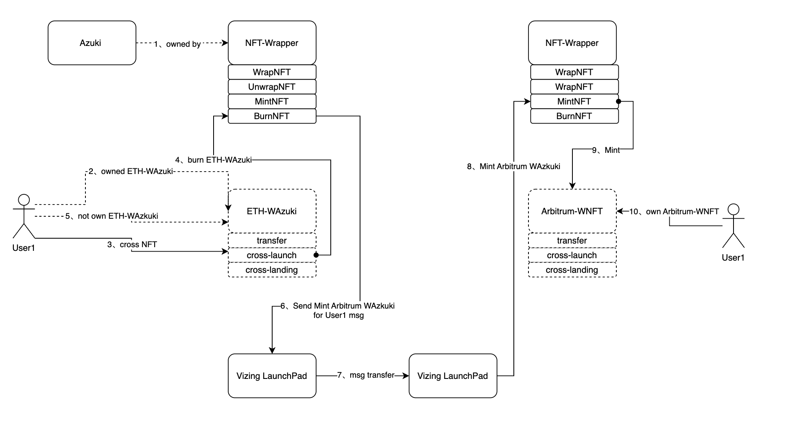

# Omni-NFT


:::caution
Omni-NFT is not yet live. We are currently in the process of finalizing the development and testing phases. We anticipate that Omni-NFT will be launched by the end of April. At that time, we will provide you with the contract address and relevant information regarding its usage and features.
:::


## 01 / Overview

Omni-NFT is a Omni-Chain solution for NFTs. The solution utilizes the Vizing to empower NFTs with Omni-Chain capabilities and allows seamless integration of standard NFT projects without modifying the NFT protocol. Through Omni-NFT, users can transfer NFT assets across different chains while retaining the ability to transfer NFTs between accounts.

## 02 / Omni-NFT Workflow

### Global NFT Identifier (gTokenId)

Omni-NFT employs a global NFT identifier (gTokenId) to uniquely identify Omni-Chain transferred NFT assets. The gTokenId is computed by hashing the source network ID, NFT project address, and NFT ID, ensuring its global uniqueness. This globally unique identifier enables NFT assets to be transferred across multiple chains where Omni-NFT is deployed.

| **name** | **sourceNetworkId** | **NFTProjAddress** | **NFTId**   | **gTokenId** |
| -------- | ------------------- | ------------------ | ----------- | ------------ |
| **type** | **uint256**         | **address**        | **uint256** | **bytes32**  |

P.S: gTokenId = keccak256(sourceNetworkId, NFTProjAddress, NFTID) 

### Omni-NFT Contract Interaction Logic

The Omni-NFT contract supports the following four interaction logic:

1. **wrapNFT**: Users transfer their original NFT assets to the Omni-NFT contract and receive a wrapped NFT (WNFT) in return. This process locks the NFT asset within the Omni-NFT contract and assigns it a globally unique gTokenId.
``` solidity
function wrapNFT(address owner, address nftProjAddress, uint256 nftId) external {
    IERC721 nftContract = IERC721(nftProjAddress);
    nftContract.transferFrom(owner, address(this), nftId); 
    
    // mint new NFT
    bytes32 gTokenId = keccak256(_networkId, nftProjAddress, nftId);// 
    _owners[gTokenId] = owner; // update owner address
}
```
1. **un-wrapNFT**: Users can call the `un-wrapNFT` method of the Omni-NFT contract to unwrap the WNFT and retrieve the original NFT asset. This allows users to reclaim their unwrapped NFT.
```solidity
function unwrapNFT(address owner, address nftProjAddress, uint256 nftId) external {

    IERC721 nftContract = IERC721(nftProjAddress);
    bytes32 gTokenId = keccak256(_networkId, nftProjAddress, nftId);
    this.checkNFTProjExist(nftProjAddress)； 
    this.checkIsWrapped(gTokenId); networkId == _networkId)
    _owners[gTokenId] = 0; /
    nftContract.transferFrom(address(this)，owner, nftId); 
}
```
1. **mintNFT**: On the target chain, the `mintNFT` method is invoked using the Vizing algorithm to mint the NFT asset on that chain. This process generates a globally unique gTokenId using the source network ID, NFT project address, and NFT ID, and mints the NFT asset on the target chain.
```solidity
function crossChainLandingNFT(address relayer, bytes landingBytes) external {
     LandingPad = ILandingPad(_landingPadAddress);
     LandingMsgStruct memory landingMsg = LandingPad.decode();
     require(landingMsg.senderContractAddress in _senderContracts); 
     // .....
}
```
1. **burnNFT**: When users want to transfer NFT assets from the source chain to the target chain, they can invoke the `burnNFT` method. This process involves burning the WNFT on the source chain and then calling the `mintNFT` method using the Vizing algorithm to mint the NFT asset on the target chain. Through this step, the NFT asset becomes available on the target chain.
```solidity
function burnNFT(address owner, bytes32 gTokenId, uint256 destNetworkId,address relayer, uint256 feeAmount
) external payable {
    // feeAmount ETH Token = destGasFee + protocolFee 
    LaunchPad = ILaunchPad(_launchPadAddress); 
    reqire(owner == msg.sender); 
    this.check_gTokenIdOwnerShip(owner, gTokenId);
    bytes memory launchMsg = encode(owner + gTokenId + destNetworkId); 
    LaunchPad.launchMsg(launchMsg);
    _owners[gTokenId] = 0; 
}
```

## 03 / Advantages of Omni-NFT

The Omni-NFT solution offers the following advantages:

- **Integration with Standard NFT Projects**: Omni-NFT allows direct integration of standard NFT projects without requiring modifications to the NFT protocol. This provides convenience for existing NFT projects to leverage the Omni-Chain functionality of Omni-NFT.
- **Global Uniqueness Identifier**: By utilizing the global NFT identifier (gTokenId), Omni-NFT achieves global uniqueness for NFT assets across multiple chains. This ensures the uniqueness and consistency of Omni-Chain transferred NFT assets on different chains.
- **Cross-Account Transfer**: Even after Omni-Chain transfers, NFT assets remain transferable across accounts. This enables users to freely transfer and trade NFT assets on different chains.


