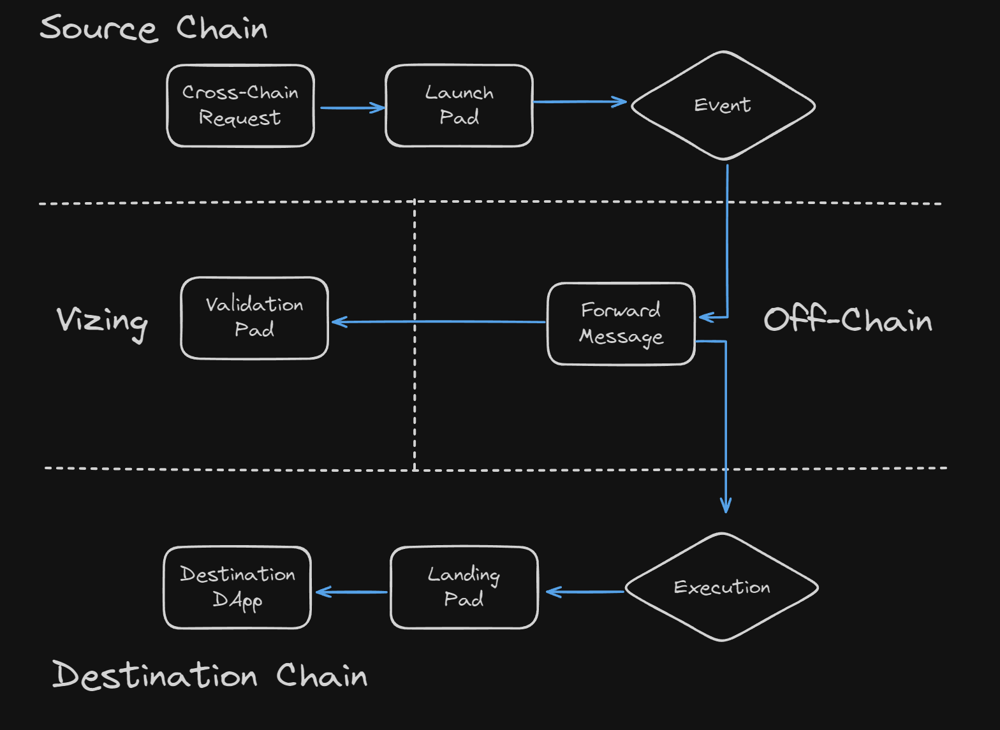

#  Lifecycle of a Message

In this article, we take Alice as an example. She will utilize an asset cross-chain bridge built on Vizing to transfer 1000 USDC from her account on the Arbitrum network to the same account on the Optimism network.

## 01 / Initiating Cross-Chain Request on the Source Chain

Alice initiates a cross-chain request on the Arbitrum network, seeking to transfer 1000 USDC from her account to the Optimism network.

Before making the request, Alice may interact with a VDApp through standard interfaces provided or intuitive GUI operations to ensure her request is correctly identified and submitted to the cross-chain bridge for processing.

## 02 / Preprocessing Cross-Chain Request by VDApp

Upon receiving Alice's cross-chain request, the DApp on the Arbitrum network undergoes several preprocessing steps to ensure the request's validity and security.

In addition to checking Alice's USDC balance, VDApp performs additional security validations, such as verifying Alice's identity and authorization status, and ensuring that the cross-chain request complies with preset rules and restrictions.

VDApp also formats Alice's request into the standard message format required by the Vizing protocol and forwards it to the core contract, LaunchPad, for further processing.

Detailed steps may include:

- Asset confirmation: Ensuring that the USDC balance is greater than 1000.
- Asset destruction: Destroying USDC on the Arbitrum network.
- Message formatting: Converting the cross-chain request into the standard format required by the Vizing message and forwarding it to the core contract, LaunchPad.

## 03 / Execution of Request by LaunchPad on the Source Chain

Upon receiving Alice's cross-chain request, the core contract, LaunchPad, executes a series of operations to ensure the smooth and secure processing of the request.

These operations include confirming Alice's asset status, recording transaction data, updating account status, etc. LaunchPad also communicates with components under the Vizing protocol for subsequent cross-chain verification and execution processes.

## 04 / Validation of Message on Vizing Rollup

Once LaunchPad processes Alice's cross-chain request and packages it into a standard message, the message is submitted to the Vizing Rollup for validation.

On the Vizing Rollup, Validators validate the message and ensure that it complies with the standards and security protocols of the Vizing protocol. This includes checking signatures, verifying account authorizations, confirming message integrity, and other steps.

Only after the message passes validation on the Vizing Rollup can it proceed to be sent to the target chain for cross-chain operations.

## 05 / Validation and Execution on the Target Chain

After passing validation on the Vizing Rollup, the message is relayed by a Relayer to the Optimism network. On the Optimism network, the LandingPad receives and validates the message, then executes the corresponding cross-chain operations.

This includes minting Alice's 1000 USDC assets to the target account and ensuring the security and correctness of the cross-chain transfer. With this step completed, Alice's assets have successfully undergone the cross-chain transfer process from Arbitrum to Optimism.