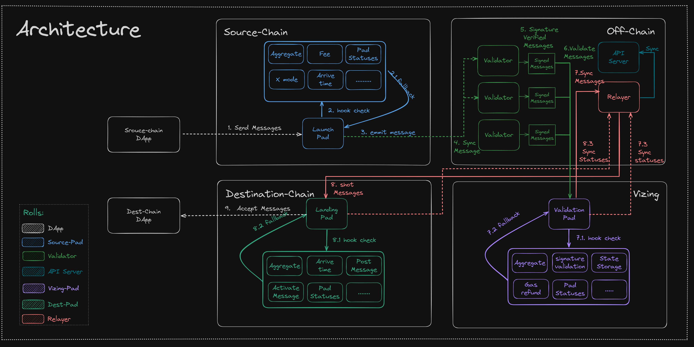

# Architecture

## 01 / On-Chain Components

**Vizing** is a decentralized and efficient information Omni-Chain transfer network composed of various components. Let's dive into the key components in detail to help you understand how Vizing achieves efficient Omni-Chain communication.

**LaunchPad**: The LaunchPad serves as the central hub for sending Omni-Chain information. It can receive information in any format and facilitates its seamless Omni-Chain forwarding.

**LandingPad**: The LandingPad acts as the receiving center for Omni-Chain information. Here, the received Omni-Chain information undergoes final verification before being forwarded to the designated DApp.

**ValidationPad**: The ValidationPad functions as the validation center for Omni-Chain information. It acts as an intermediary for all Omni-Chain information, ensuring its integrity and authenticity. Eventually, the validated information becomes part of the Layer2 Rollup and gets confirmed on the Ethereum mainnet.

## 02 / Off-Chain Components

Vizing places significant importance on off-chain components. Unlike on-chain components, the focus here is on the decentralized nature of these components, making a valuable contribution to the decentralized network.

**Validator**: Validators play a crucial role in ensuring the security of Omni-Chain information. Obtaining the Validator status requires staking, granting validators access to all Omni-Chain information and the authority to sign the information. Omni-Chain information from any chain must be signed by Validators and published on the Vizing Layer2 to enable its Omni-Chain transfer capability.

**Relayer**: Relayers act as messengers for transmitting Omni-Chain information. Once you acquire the Validator status, consider obtaining the Relayer status as well. Vizing grants Relayers the permission to forward Omni-Chain information, allowing them to actively participate in the interaction among the on-chain components.

**Validators Network**: In Vizing, Omni-Chain information requests go through multiple Validators for validation and signature before being confirmed and forwarded by Relayers to the target network. The confirmation of message delivery is determined by obtaining the majority of signatures from Validators, typically using a 2/3 consensus mechanism.

**API**: The API provides detailed information on using Vizing for Omni-Chain communication, allowing developers to integrate and utilize Vizing's capabilities effectively.

## 03 / Layer2 Rollup

Vizing is built on top of Layer2 Rollup, enhancing it's security and providing exceptional advantages.

**Vizing Rollup**: Vizing introduces its own Layer2 network called Vizing Rollup. All information sent using Vizing is forwarded to Vizing Rollup, which eventually undergoes Validum proof and gets confirmed on the Ethereum mainnet. This integration with Layer2 Rollup ensures scalability, efficiency, and security for the Vizing protocol.

With its comprehensive architecture and components, Vizing empowers developers to build robust and efficient web3 Omni-Chain protocols, enabling seamless interoperability across different blockchain networks.

