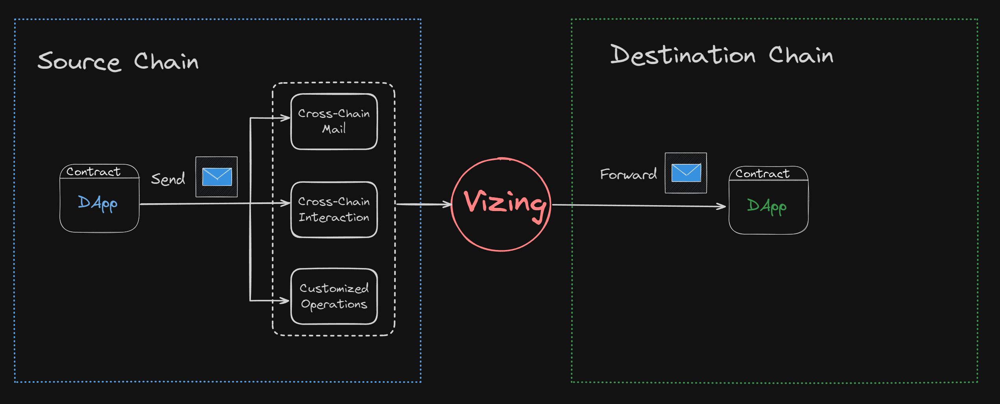

# Introduction

**Vizing** is an Ethereum Layer 2-based Omni-Chain interoperability protocol that supports messaging in any format.

Meanwhile, Vizing is a permissionless decentralized network that provides all DApps with the ability to interact with multiple chains by integrating with Vizing.

Building DApps using Vizing goes beyond simple token transfers between chains. The envisioned DApp possibilities include but are not limited to:

1. Omni-Chain asset bridges:  
    Rapid deployment of Omni-Chain asset bridges allows wrapping tokens from the original chain in the early stages of a newly deployed blockchain. This provides liquidity in the form of WTokens to the new blockchain.
    
2. Omni-Chain lending:  
    Omni-Chain lending is a significant feature of the Vizing protocol. Users can securely and efficiently transfer assets between different blockchains, enabling borrowing and lending operations across chains. This allows users to leverage their assets on different chains, participate in a wider range of financial activities, and achieve better capital efficiency.
    
3. Omni-Chain gaming:  
    Vizing provides robust support for Omni-Chain gaming development. Game developers can seamlessly transfer game assets from one chain to another, creating a seamless Omni-Chain gaming experience. Players can trade, collect, and utilize game items on different blockchains, enjoying a broader gaming world and more interactive possibilities.
    
4. Oracles:  
    Unlike traditional push-based oracles, Vizing protocol allows the development of pull-based oracles. This means third-party DApps can set their own intervals to fetch the latest data from other chains and apply it to on-chain smart contracts. This flexible data retrieval method provides diverse and real-time data support for various use cases, further enhancing the usability and reliability of decentralized applications.
    
5. Omni-Chain DAO governance:  
    Vizing protocol also supports Omni-Chain DAO governance, enabling governance organizations on Layer 2 to participate in decision-making and voting processes on Layer 1. This Omni-Chain governance model enhances the capabilities of decentralized autonomous organizations, allowing participants from different chains to collectively manage and make decisions in a consistent manner, fostering collaborative development in the blockchain ecosystem.
    

Please note that the above examples are just a glimpse of what the Vizing protocol can achieve. There are many other exciting application scenarios waiting for developers to explore and create. By utilizing the Vizing protocol, you can build Omni-Chain DApps with limitless possibilities, providing users with unparalleled experiences.

